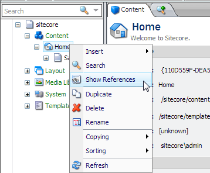
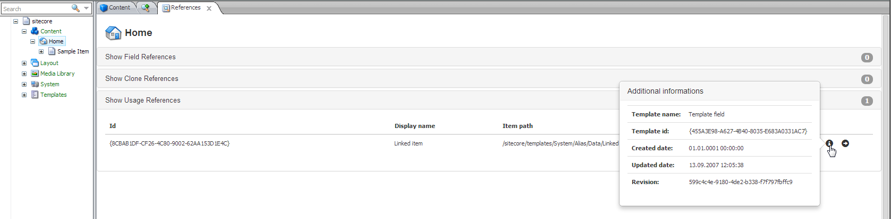

# Sitecore Referenception Module

This module was created during the [First Sitecore Hackathon](http://sitecorehackathon.org/first-ever-sitecore-hackathon/) with the idea **Best Authoring Experience Enhancement Module (Content Editor/Media Library)**. The module should give the content authors the possibility to view many different types of references on a Item in the Content Editor. The module can be started with a right click on any item in the Content Editor:

A new tab is opened with different types of references, so called Providers. It is possible to add as many custom Providers as you like. Each provider can have a set of columns, data rows and additional informations for each row:

This documentation is also available under *misc/doc/readme.pdf*.

## Installation
### Manual Installation
You can clone the repository and build the source code. You need to copy all assemblies listed in the README.md in the *lib* directory, otherwise you won't be able to build because of missing references. There are some MSBuild targets which copy all needed files into a directory defined in the *build/deploy.txt* file. Just create the *build/deploy.txt* file and insert the directory where you want to copy all the files to. You also need to copy the *misc/serialization* folder into your data folder and update the Core database.

### Installation Package
There is a package to install the module via the Sitecore Package Manager. The package is located under *misc/installation/Sitecore Referenception-1.0.0.zip*.

### Sample Package
There is also a sample package available, which provides a new template with some items to show how the module works. The sample package is located under *misc/installation/Sitecore Referenception Example Data-1.0.0.zip*.

## Configuration
There is a configuration file `Referenception.config` in the `App_Config/Include` folder. The config includes some module settings and all the providers. All the providers are configured under `/sitecore/referenception/providers` with the following minimal structure (as an example):
    
    <provider type="Referenception.Common.CloneReferencesProvider, Referenception.Providers">
      <title>Show Clone References</title>
      <templates hint="list">
        <template>Standard template</template>
      </templates>
    </provider>

- `type`: Implementation type of the provider.
- `title`: Title for the provider in the references tab.
- `templates`: List of template names. This provider is shown for all items which either have this template directly or as one of the base templates.

Each provider can have additional configuration elements.

## Available Providers
The module is shipped with the reference implementations.

### FieldReferencesProvider
This provider displays all fields of the current item which references another item. For each field, the referenced items are displayed. This provider is available for all items by default.

### CloneReferencesProvider
This provider displays all clones of the current item and is available for all items by default.

### UsageReferencesProvider
This provider displays all items, which reference the current item in any field. This provider is available for all items by default.

## Custom Providers
It's easy to create custom providers. You have to follow these steps to create your own provider:

1. Create a custom class and inherit from the abstract class `ReferenceProviderBase`. This means you have to override the method `GetData(Item sourceItem)` and return a `DataTable` object with all the data you want to display in the references tab.
2. If you want to add additional information, add a column of type `IDictionary<string, string> `to your DataTable and override the method `GetTooltip(DataRow row)`.
3. If you want to make a link to the item in the table row, you have to override the method `GetLinkItemId(DataRow row)` and return the ID of the target item.
4. Configure your provider in the config file. The minimal config is described under *Configuration*. It's also possible to add custom configurations, see `FieldReferencesProvider` for an example.
